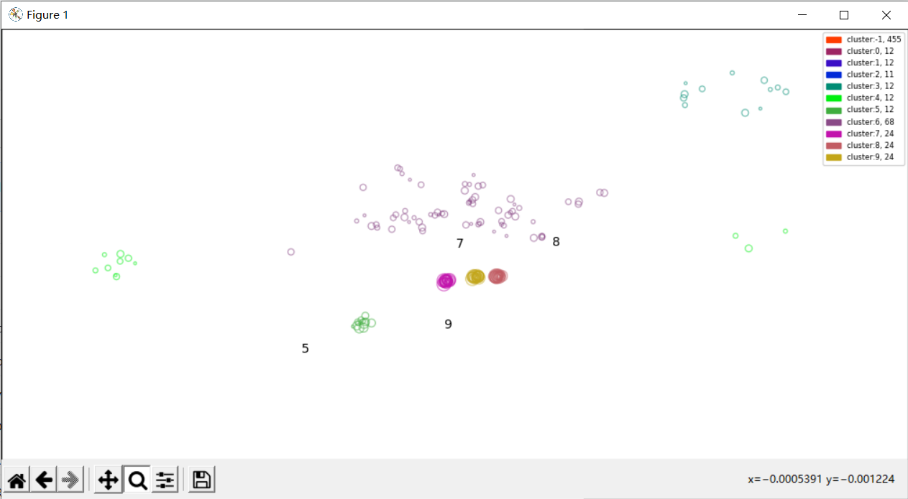

## Welcome to PyPhm Pages

The skeleton of PyPhm is automated created by cookiecutter.
>> cookiecutter https://github.com/audreyr/cookiecutter-pypackage.git

### CWRU bearing datasets
Cluster:5/7/8/9 are baseline samples, which are in good conditons.
The other points are sattered away depart from the good ones.
Point size gets bigger and bigger by times.
Cluster 5/7/8/9 work at different loads.

### IMS bearing datasets
There were 3 independent run to failure tests.
Points in Cluster 1,2,3 are grandually depart away.

